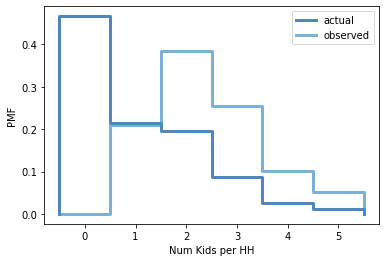

## [Think Stats Chapter 3 Exercise 1](http://greenteapress.com/thinkstats2/html/thinkstats2004.html#toc31) (actual vs. biased)

### PMF of actual num kids distribution
```
numk_pmf = thinkstats2.Pmf(resp.numkdhh,label="actual")
numk_pmf
```
#### Pmf({0: 0.466178202276593, 1: 0.21405207379301322, 2: 0.19625801386889966, 3: 0.08713855815779145, 4: 0.025644380478869556, 5: 0.01072877142483318}, 'actual')

### Histogram of dist
```
thinkplot.Pmf(pmf)
thinkplot.Config(xlabel='Number of children', ylabel='PMF')
```

### Biased dist function
```
def BiasPmf(pmf,label):
    new_pmf=pmf.Copy(label=label)
    for x,p in pmf.Items():
        new_pmf.Mult(x,x)
    new_pmf.Normalize()
    return new_pmf

biased_pmf=BiasPmf(numk_pmf,label="observed")
```




### Plot actual vs. obs distributions
```
thinkplot.PrePlot(2)
thinkplot.Pmfs([numk_pmf,biased_pmf])
thinkplot.Show(xlabel='Num Kids per HH',ylabel='PMF')
```

### Print means of actual and obs dist
```
print('mean actual',numk_pmf.Mean())
print('mean obs',biased_pmf.Mean())
```
#### mean actual 1.024205155043831
#### mean obs 2.403679100664282
