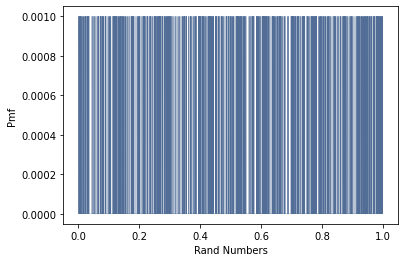
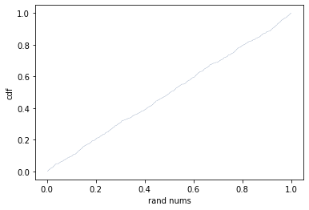

### [Think Stats Chapter 4 Exercise 2](http://greenteapress.com/thinkstats2/html/thinkstats2005.html#toc41) (a random distribution)

### Exercise: The numbers generated by numpy.random.random are supposed to be uniform between 0 and 1; that is, every value in the range should have the same probability.

### Generate 1000 numbers from numpy.random.random and plot their PMF. What goes wrong?
```
xrand=np.random.random(1000)
```
### Plot PMF
```
randpmf = thinkstats2.Pmf(xrand, label='')
thinkplot.Pmf(randpmf,linewidth=0.2)
thinkplot.Config(xlabel='Rand Numbers', ylabel='Pmf')
```


### We see a uniform distribution of 1000 random numbers. It's too hard to distinguish each random variate although they have the same probability.

### Now plot the CDF. Is the distribution uniform?
```
randcdf=thinkstats2.Cdf(xrand)
thinkplot.Cdf(randcdf,linewidth=0.2)
thinkplot.Config(xlabel="rand nums",ylabel="cdf")
```


### The line is straight which signifies a uniform distribution.

## testing new line
